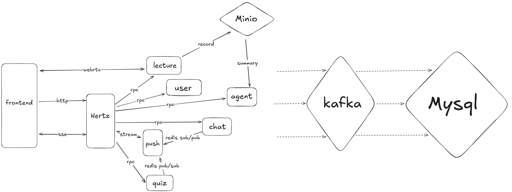

 

  ## 🧾 ApexLecture 

  **ApexLecture** 是一个简单实用的在线课堂直播平台，支持老师发起直播、学生观看课程、参与答题互动，并实现了基础的消息推送和数据记录功能。

  ------

  ## 🏗️ 服务调用图

  

  ## 🎯 项目功能

  - ✅ **直播推流**：使用 [WebRTC](https://github.com/pion/webrtc) 实现音视频推送，支持直播和回放。
  - ✅ **学生在线状态管理**：通过连接状态记录学生是否在听课，可统计上课时长。
  - ✅ **答题互动**：支持选择题和判断题，学生作答后系统自动记录答题情况，并且会实时通过 push 将答题状态同步给老师。
  - ✅ **实时聊天**：学生和老师可进行简单文本交流。
  - ✅ **消息推送**：chat 和 quiz 消息通过 Redis 发布，由 push 服务通过 SSE 发送给前端。
  - ✅ **异步入库**：部分数据使用 RabbitMQ 异步入库，多次重试后，将消息丢入死信队列，后台重新放入队列，并且定期打印日志。
  - ✅ **用户管理**：支持用户注册、登录和身份校验。
  - ✅ **可观测性**：基于 ELK 集成日志系统，jaeger/Prometheus/opentelemetry 实现监控。
  - ✅ **集成AI**：基于 eino 框架实现了可爱问答女仆功能，可以随时与学生进行交互，理论支持智能纪要(智能纪要没测试过，语音识别那个crediential好像有点麻烦)。

  ------

  ## 📚 技术选型

  - 后端框架：`Hertz` + `Kitex`
  - 推流：`pion/webrtc`
  - 大模型：`eino`
  - 消息队列：`Redis Pub/Sub` + `RabbitMQ`
  - 数据库：`MySQL` + `Redis` + `MinIO`
  - 监控工具：`Prometheus` + `Grafana` + `Jaeger`
  - 协程控制：使用 [`ants`](https://github.com/panjf2000/ants) 协程池限制协程数量
  - 限流：使用 `sentinel-golang` 实现限流
  - 一致性哈希：直播推流依赖于内存，故基于一致性哈希算法，确保同一个房间的请求落在同一个直播节点上。
  - 敏感词屏蔽：使用第三方库 [`sensitive`](https://github.com/importcjj/sensitive) 实现敏感词屏蔽
  - 容器化部署：编写 `Dockerfile` 实现，当前基于 `docker compose` 实现容器化部署。

  ------

  ## 📎 资料

  - 📄 [接口文档（Apifox）](https://apifox.com/apidoc/shared/ec05339a-ba50-46d9-9971-1d9ef2347f2c/297132962e0)
  - 📄 [项目详细介绍（DeepWiki）](https://deepwiki.com/Rinai-R/ApexLecture)

  ## 快速开始

  1. 克隆项目到本地：

  ```bash
  git clone https://github.com/Rinai-R/ApexLecture.git

  git clone git@github.com:Rinai-R/ApexLecture.git
  ```

  2. 安装依赖：

  ```bash
  go mod tidy
  ```

  3. 拉取依赖：

  ```bash
  make up
  ```

  4. 启动服务：

  ```bash
  make hz-run
  
  make user-run
  
  make lecture-run
  
  make chat-run
  
  make push-run
  
  make quiz-run

  make agent-run
  ```

